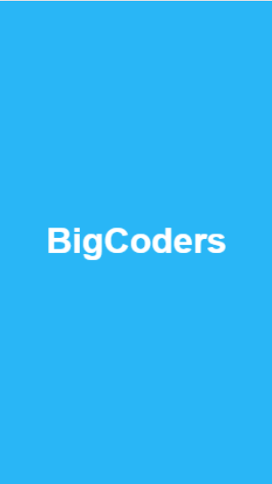
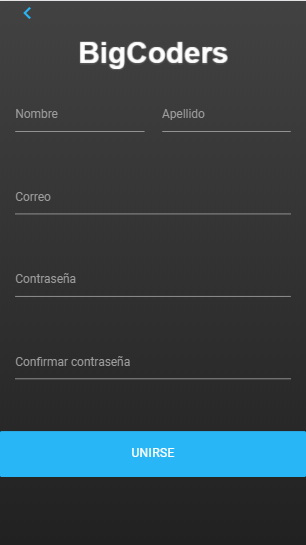
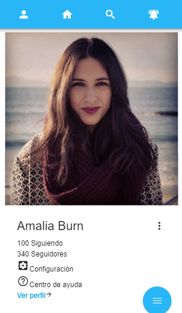

# **BigCoders Social Network**
--------

- ## **Objetivo**

    Crear una red social que contribuya a la solución de una problemática.

- ## **Puntos a considerar**
    - Perfiles de usuarios

    - Un newsfeed donde puedes ver las actualizaciones de todos tus contactos

    - Un lugar donde poder escribir posts

    - Un lugar para subir fotos

    - Capacidad para poder tener amigos o para poder seguir a personas/marcas dentro de la red social

    - Ser mobile friendly.

- ## **Mobile design**

